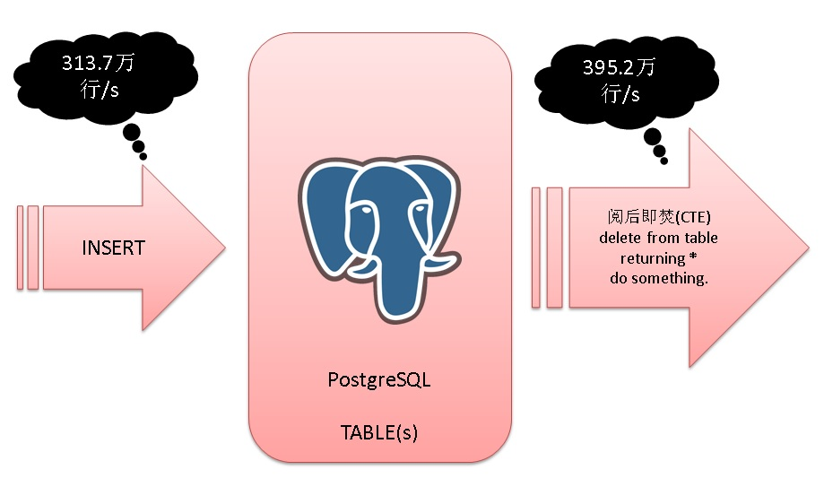

## HTAP数据库 PostgreSQL 场景与性能测试之 27 - (OLTP) 物联网 - FEED日志, 流式处理 与 阅后即焚 (CTE)  
  
### 作者  
digoal  
  
### 日期  
2017-11-07  
  
### 标签  
PostgreSQL , HTAP , OLTP , OLAP , 场景与性能测试  
  
----  
  
## 背景  
PostgreSQL是一个历史悠久的数据库，历史可以追溯到1973年，最早由2014计算机图灵奖得主，关系数据库的鼻祖[Michael_Stonebraker](https://en.wikipedia.org/wiki/Michael_Stonebraker) 操刀设计，PostgreSQL具备与Oracle类似的功能、性能、架构以及稳定性。  
  
  
  
PostgreSQL社区的贡献者众多，来自全球各个行业，历经数年，PostgreSQL 每年发布一个大版本，以持久的生命力和稳定性著称。  
  
2017年10月，PostgreSQL 推出10 版本，携带诸多惊天特性，目标是胜任OLAP和OLTP的HTAP混合场景的需求：  
  
[《最受开发者欢迎的HTAP数据库PostgreSQL 10特性》](../201710/20171029_01.md)  
  
1、多核并行增强  
  
2、fdw 聚合下推  
  
3、逻辑订阅  
  
4、分区  
  
5、金融级多副本  
  
6、json、jsonb全文检索  
  
7、还有插件化形式存在的特性，如 **向量计算、JIT、SQL图计算、SQL流计算、分布式并行计算、时序处理、基因测序、化学分析、图像分析** 等。  
  
  
  
在各种应用场景中都可以看到PostgreSQL的应用：  
  
  
  
PostgreSQL近年来的发展非常迅猛，从知名数据库评测网站dbranking的数据库评分趋势，可以看到PostgreSQL向上发展的趋势：  
  
  
  
从每年PostgreSQL中国召开的社区会议，也能看到同样的趋势，参与的公司越来越多，分享的公司越来越多，分享的主题越来越丰富，横跨了 **传统企业、互联网、医疗、金融、国企、物流、电商、社交、车联网、共享XX、云、游戏、公共交通、航空、铁路、军工、培训、咨询服务等** 行业。  
  
接下来的一系列文章，将给大家介绍PostgreSQL的各种应用场景以及对应的性能指标。  
  
## 环境  
环境部署方法参考：  
  
[《PostgreSQL 10 + PostGIS + Sharding(pg_pathman) + MySQL(fdw外部表) on ECS 部署指南(适合新用户)》](../201710/20171018_01.md)  
  
阿里云 ECS：```56核，224G，1.5TB*2 SSD云盘```。  
  
操作系统：```CentOS 7.4 x64```  
  
数据库版本：```PostgreSQL 10```  
  
PS：**ECS的CPU和IO性能相比物理机会打一定的折扣，可以按下降1倍性能来估算。跑物理主机可以按这里测试的性能乘以2来估算。**  
  
## 场景 - 物联网 - FEED日志, 流式处理 与 阅后即焚 (CTE) (OLTP)  
  
### 1、背景  
在几乎所有的行业中，例如物联网、互联网、金融等的业务系统中，都会包括FEED数据，即轨迹，包括用户行为轨迹，业务系统产生的日志等。  
  
这些数据通常被用于流式处理，历史可以被保留用于分析，也可以不保留（视业务需要）。  
  
如果FEED数据不需要被保留，仅需要流式处理的话，那么就涉及两个问题：  
  
1、高速写入(insert)  
  
[《HTAP数据库 PostgreSQL 场景与性能测试之 24 - (OLTP) 物联网 - 时序数据并发写入(含时序索引BRIN)》](../20171107_25.md)  
  
**阿里云ECS，56核的机器，写入速度约 313.7 万行/s。**  
  
2、高速消费(delete and compute)  
  
本文测的是高速消费。  
  
  
  
我在几年前给某个核电和火电监测项目设计过一个这样的架构，可以满足数据的高速写入，以及数据的高速消费，不留痕迹。  
  
最近双十一的某个实时处理业务，也可以使用这种架构。  
  
[《PostgreSQL 异步消息实践 - Feed系统实时监测与响应(如 电商主动服务) - 分钟级到毫秒级的跨域》](../201711/20171111_01.md)  
  
### 2、设计  
100万个传感器，2048个分区，总共20亿条已写入的传感器上报数据。  
  
并行、批量的消费。  
  
### 3、准备测试表  
  
```  
create table t_sensor (sid int, info text, crt_time timestamp);  
create index idx_t_sensor on t_sensor (crt_time) tablespace tbs1;  
```  
  
使用2048个分表。  
  
```  
do language plpgsql $$  
declare  
begin  
  for i in 0..2047 loop  
    execute 'create table t_sensor'||i||'(like t_sensor including all) inherits(t_sensor)';  
  end loop;  
end;  
$$;  
```  
  
### 4、准备测试函数(可选)  
1、批量生成传感器测试数据的函数  
  
```  
CREATE OR REPLACE FUNCTION public.ins_batch(integer,integer)  
 RETURNS void  
 LANGUAGE plpgsql  
 STRICT  
AS $function$  
declare  
  suffix int := mod($1, 2048);  
begin  
  execute 'insert into t_sensor'||suffix||' select '||$1||', 0.1, now() from generate_series(1,'||$2||')';  
end;  
$function$;  
```  
  
2、批量消费传感器数据的函数，按时间，从最早开始消费。  
  
处理逻辑也可以放到里面，例如预警逻辑(采用PostgreSQL异步消息、CTE语法)。  
  
[《PostgreSQL 异步消息实践 - Feed系统实时监测与响应(如 电商主动服务) - 分钟级到毫秒级的跨域》](../201711/20171111_01.md)  
  
[《PostgreSQL 内存表》](../201608/20160818_01.md)  
  
```  
CREATE OR REPLACE FUNCTION public.consume_batch(integer,integer)  
 RETURNS void  
 LANGUAGE plpgsql  
 STRICT  
AS $function$  
declare  
  suffix int := mod($1, 2048);  
begin  
  -- 带流式处理业务逻辑的例句(采用CTE语法)：  
  -- with t1 as (delete from t_sensor$suffix where ctid = any(array(select ctid from t_sensor$suffix order by crt_time limit 1000)) returning *)  
  --   select pg_notify('channel_name', 'reason:xxx::::'||row_to_json(t1)) from t1 where ......;  
  --  
  -- 如果有多个判断基准，可以先存入TMP TABLE，再到TMP TABLE处理。  
  -- 使用普通的TMP table或者使用内存TMP TABLE。  
  -- [《PostgreSQL 内存表》](../201608/20160818_01.md)  
  
  -- 本例仅测试不带处理逻辑，只消费的情况，关注消费速度。  
  execute format('delete from t_sensor%s where ctid = any(array(select ctid from t_sensor%s order by crt_time limit %s))', suffix, suffix, $2);  
end;  
$function$;  
```  
  
### 5、准备测试数据  
100万个传感器，准备20亿条传感器上报的数据。  
  
```  
vi test.sql  
  
\set sid random(1,1000000)  
select ins_batch(:sid, 1000);  
```  
  
```  
pgbench -M prepared -n -r -P 5 -f ./test.sql -c 50 -j 50 -t 40000
```  
  
### 6、准备测试脚本  
  
```  
vi test.sql  
  
\set sid random(1,1000000)  
select consume_batch(:sid, 1000);  
```  
  
压测  
  
```  
CONNECTS=56  
TIMES=300  
export PGHOST=$PGDATA  
export PGPORT=1999  
export PGUSER=postgres  
export PGPASSWORD=postgres  
export PGDATABASE=postgres  
  
pgbench -M prepared -n -r -f ./test.sql -P 5 -c $CONNECTS -j $CONNECTS -T $TIMES  
```  
  
### 7、测试  
平均每秒消费  条，阅后即焚。  
  
```  
transaction type: ./test.sql
scaling factor: 1
query mode: prepared
number of clients: 56
number of threads: 56
duration: 300 s
number of transactions actually processed: 1186351
latency average = 14.160 ms
latency stddev = 7.224 ms
tps = 3951.962388 (including connections establishing)
tps = 3952.325191 (excluding connections establishing)
script statistics:
 - statement latencies in milliseconds:
         0.002  \set sid random(1,1000000)  
        14.159  select consume_batch(:sid, 1000);
```  
  
#### TPS： 3952  
**相当于消费 395.2 万行/s。**   
  
#### 平均响应时间： 14.1 毫秒  
  
  
## 参考  
[《PostgreSQL、Greenplum 应用案例宝典《如来神掌》 - 目录》](../201706/20170601_02.md)  
  
[《数据库选型之 - 大象十八摸 - 致 架构师、开发者》](../201702/20170209_01.md)  
  
[《PostgreSQL 使用 pgbench 测试 sysbench 相关case》](../201610/20161031_02.md)  
  
[《数据库界的华山论剑 tpc.org》](../201701/20170125_01.md)  
  
https://www.postgresql.org/docs/10/static/pgbench.html  
  
