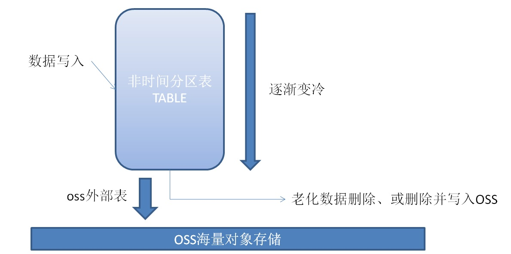

## 如何根据行号高效率的清除过期数据 - 非分区表，数据老化实践  
                        
### 作者                          
digoal                         
                           
### 日期                           
2017-12-08                      
                                    
### 标签                    
PostgreSQL , 数据老化 , 数据过期 , 行号 , array in , oss外部表      
                    
----                    
                     
## 背景  
数据按时间维度老化，删除或转移，是很多业务都有的需求。  
  
例如业务的FEED数据，CDN的日志数据，物联网的跟踪数据等，有时间维度，可能再有状态值（标记最终状态）。  
  
阿里云RDS PG， HDB PG都对接了OSS存储，可以在OSS中存储冷数据。  
  
  
  
我们可以将老化数据直接删除，也可以将老化数据删除并写入OSS外部表。  
  
而假如我们的表是按老化字段分区的，那么我们可以通过DROP 分区表的方式来老化。  
  
## 按分区老化  
  
```  
postgres=# create table t_range(id int, info text, crt_time timestamp) partition by range (crt_time);    
CREATE TABLE    
```    
      
分区      
      
```    
postgres=# create table t_range_0_201610 partition of t_range (id  primary key, info , crt_time ) for values from ('2016-10-01') to ('2016-11-01');  -- >= 20161001 and < 20161101    
CREATE TABLE    
postgres=# create table t_range_0_201611 partition of t_range (id  primary key, info , crt_time ) for values from ('2016-11-01') to ('2016-12-01');  -- >= 20161101 and < 20161201    
CREATE TABLE    
```  
  
按分区老化  
  
```  
postgres=# drop table t_range_0_201610;  
DROP TABLE  
```  
  
按分区老化并转换为oss表  
  
```  
1、创建OSS外部表  
  
create foreign table ft_xxx ..... ;  
https://help.aliyun.com/knowledge_detail/43352.html  
  
2、将需要老化的数据写入外部表  
  
insert into ft_xxx select * from 老化分区;  
  
3、修改外部表的约束（指定老化分区的时间区间）  
  
alter foreign table ft_xxx add constraint ck1 check(xx between x and x);  
  
4、将外部表挂到主表下面继承（可选，如果业务还需要直接查询）  
  
alter foreign table inherit 父表;  
  
5、删掉老化分区  
  
drop table t_range_0_201610;  
```  
  
## 按字段老化  
按老化字段来老化，指表没有分区时，通过DELETE语句来老化。  
  
创建测试表，假设STATE字段用来标记记录的最终状态，只有达到最终状态，并且时间大于老化时间的记录可以被老化。  
  
```  
create table tbl (id int , info text, state int, crt_time timestamp);  
```  
  
创建索引  
  
```  
create index idx_tbl_1 on tbl (crt_time) where state=?;  
```  
  
### 一次老化N条数据  
  
```  
delete from tbl where ctid = any (  
array  
  (  
  select ctid from tbl where crt_time < ? and state=? order by crt_time limit 1000000  -- 一次老化100万条  
  )  
);  
  
vacuum tbl;  
```  
  
### 一次老化N条数据，并迁移到OSS外部表  
  
使用CTE语法，删除并写入。  
  
  
```  
with tmp as (  
delete from tbl where ctid = any (  
array  
  (  
  select ctid from tbl where crt_time < ? and state=? order by crt_time limit 1000000  -- 一次老化100万条  
  )  
) returning *  
)  
insert into oss外部表 select * from tmp;  
  
vacuum tbl;  
```  
  
老化速度，一亿记录，老化100万条，约380毫秒。  
  
### 调度  
[《PostgreSQL 定时任务方法2》](../201305/20130531_02.md)    
  
[《PostgreSQL Oracle 兼容性之 - DBMS_JOBS - Daily Maintenance - Timing Tasks(pgagent)》](../201305/20130531_01.md)    
  
## 参考  
[《随机记录并发查询与更新(转移、删除)的"无耻"优化方法》](../201501/20150129_01.md)    
  
[《HTAP数据库 PostgreSQL 场景与性能测试之 25 - (OLTP) IN , EXISTS 查询》](../201711/20171107_26.md)  
  
