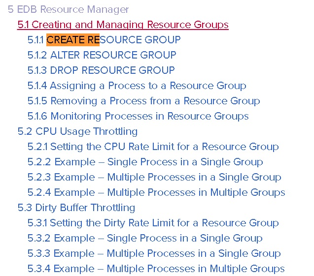

## PostgreSQL 商用版本EPAS(阿里云ppas(Oracle 兼容版)) HTAP功能之资源隔离管理 - CPU与刷脏资源组管理
                           
### 作者                           
digoal                           
                           
### 日期                           
2018-01-13                          
                           
### 标签                           
PostgreSQL , HTAP , PPAS , enterprisedb , 资源隔离 , cpu , io     
                           
----                           
                           
## 背景     
随着硬件发展，单机的能力越来越强，单个数据库可能服务于多个业务，或者服务于混合场景。例如即有分析型也有在线事务型处理（HTAP）。   
   
资源隔离管理成为非常重要的需求。   
   
对于Linux的用户，使用cgroup可以用来隔离进程的网络、CPU、IO、内存等。PostgreSQL为进程模型，使用cgroup可以实现资源隔离。   
   
[《Linux cgroup - memory子系统讲解》](../201701/20170111_02.md)     
   
[《Linux cgroup - cpu与cpuset子系统讲解》](../201606/20160613_01.md)     
   
[《cgroup告诉你如何计算 PostgreSQL 数据库实例用了多少内存》](../201509/20150926_01.md)     
   
在内核层面实现资源隔离也是一个不错的选择，可以实现库级、会话级、用户级的资源限制和隔离。例如Greenplum的resource queue。   
   
[《Greenplum 资源隔离的原理与源码分析》](../201607/20160718_01.md)     
   
[《Greenplum 内存与负载管理(resource queue)最佳实践》](../201708/20170821_01.md)     
   
在PostgreSQL商用发行版本Enterprisedb中，提供了内核层面的resource queue功能，可以控制用户的IO和CPU使用。    
  
[阿里云PPAS商用版本(兼容Oracle)](https://www.aliyun.com/product/rds/ppas)      
   
   
   
控制包括：   
   
1、可以用多少个CPU CORE   
   
2、每秒可以产生多少KB 的 dirty IO（实际上是shared buffer dirty page的产生速度，非dirty page都不算。通过pg_stat_statements.shared_blks_dirtied统计）   
   
## 参数：   
   
https://www.enterprisedb.com/docs/en/10.0/EPAS_Guide_v10/EDB_Postgres_Advanced_Server_Guide.1.26.html#pID0E0DOF0HA   
   
1、整个PG集群允许多少个活跃资源组(默认16)，重启生效。   
   
```   
vi postgresql.conf   
   
edb_max_resource_groups = 16   
```   
   
务必设置足够大，大于你需要创建的资源组个数。   
   
2、设置当前会话使用哪个资源组，优先级如下：会话级 > 用户级 > 库级 > 集群级。   
   
```   
edb_resource_group = ''   
```   
   
## 如何限制CPU和IO (DDL语法)：   
   
https://www.enterprisedb.com/docs/en/10.0/EPAS_Guide_v10/EDB_Postgres_Advanced_Server_Guide.1.55.html#pID0E0MOC0HA   
   
1、创建资源组   
   
```   
Command:     CREATE RESOURCE GROUP   
Description: define a new resource group   
Syntax:   
CREATE RESOURCE GROUP name   
```   
   
```   
postgres=# create resource group abc;   
```   
   
2、配置资源组的限制，可以设置CPU和IO两种限制。   
   
```   
Command:     ALTER RESOURCE GROUP   
Description: change the definition of a resource group   
Syntax:   
ALTER RESOURCE GROUP name RENAME TO new_name   
ALTER RESOURCE GROUP name SET parameter { TO | = } { value | DEFAULT }   
ALTER RESOURCE GROUP name RESET parameter   
   
   
cpu_rate_limit   
dirty_rate_limit   
```   
   
```   
-- ABC这个组可以使用32个CPU核。   
alter resource group abc set cpu_rate_limit = 32;   
   
-- abc这个组，每秒最多产生 400MB dirty shared buffer.   
alter resource group abc set dirty_rate_limit =409600;   
   
-- 0表示不限制。   
```   
   
3、查看系统中创建了多少资源组，以及资源组的限制。   
   
```   
postgres=# select * from edb_resource_group ;   
 rgrpname | rgrpcpuratelimit | rgrpdirtyratelimit    
----------+------------------+--------------------   
 b        |                0 |                  0   
 abc      |               32 |             409600   
(2 rows)   
```   
   
4、设置当前会话资源组，当前会话生效。   
   
```   
postgres=# set edb_resource_group ='b';   
SET   
```   
   
4\.1、设置用户级资源组，使用这个用户连接时生效。   
   
```   
postgres=# alter role enterprisedb set edb_resource_group ='b';   
ALTER ROLE   
```   
   
4\.2、设置库级资源组，连接到这个库时生效。   
   
```   
postgres=# alter database postgres set edb_resource_group ='abc';   
ALTER DATABASE   
```   
   
4\.3、设置集群级资源组，集群级默认资源组。   
   
```   
vi $PGDATA/postgresql.conf   
   
edb_resource_group = 'abc'   
```   
   
5、查看集群中的用户、数据库级资源控制配置参数。   
   
```   
postgres=#    
select    
  coalesce(datname,'ALL'),   
  coalesce(rolname,'ALL'),   
  setconfig    
from pg_db_role_setting t1    
left join pg_database t2    
  on (t1.setdatabase=t2.oid)    
left join pg_roles t3    
  on (t1.setrole=t3.oid);   
   
   
 coalesce |   coalesce   |       setconfig           
----------+--------------+------------------------   
 ALL      | enterprisedb | {edb_resource_group=b}   
(1 row)   
```   
   
6、查看当前会话属于哪个资源组。   
   
```   
postgres=# show edb_resource_group ;   
 edb_resource_group    
--------------------   
 b   
(1 row)   
```   
   
7、查看当前资源组的资源使用情况。   
   
per_process_cpu_rate_limit表示这个组内，当前平均每个进程的CPU核数使用限制。   
   
per_process_dirty_rate_limit表示这个组内，当前瓶颈每个进程限制的产生dirty page的速度(KB/s)   
   
随着进程数的加减，平均值会有变化。每个进程的限制并不是平均数，组内的进程可以相互抢资源，如果只有一个活跃进程在组内，则这个活跃进程可以使用这个组的所有资源。   
   
```   
postgres=# select * from edb_all_resource_groups ;   
   
 group_name | active_processes | cpu_rate_limit | per_process_cpu_rate_limit | dirty_rate_limit | per_process_dirty_rate_limit    
------------+------------------+----------------+----------------------------+------------------+------------------------------   
 b          |                1 |              0 |                   16777216 |                0 |                     16777216   
 abc        |                0 |             32 |                            |           409600 |                                
(2 rows)   
```   
   
组与组之间没有牵制，所以多个组可以配置超过机器的总资源限制（类似云计算的超卖），但是繁忙时，可能相互抢占。   
   
## CPU 限制，原理：   
周期性的统计组内进程的资源使用情况，并限制资源(sleep)的使用。   
   
https://www.enterprisedb.com/docs/en/10.0/EPAS_Guide_v10/EDB_Postgres_Advanced_Server_Guide.1.56.html#pID0E0JJC0HA   
   
PostgreSQL 代码中，getrusage是来获得CPU资源的使用情况的。   
   
## IO 限制，原理：   
   
（仅限制shared buffer中的dirty page产生速度）   
   
https://www.enterprisedb.com/docs/en/10.0/EPAS_Guide_v10/EDB_Postgres_Advanced_Server_Guide.1.57.html#pID0E0CCC0HA   
   
## 动态视图与参数：   
   
https://www.enterprisedb.com/docs/en/10.0/EPAS_Guide_v10/EDB_Postgres_Advanced_Server_Guide.1.88.html#   
   
https://www.enterprisedb.com/docs/en/10.0/EPAS_Guide_v10/EDB_Postgres_Advanced_Server_Guide.1.92.html#   
   
查看集群中的用户、数据库级资源控制配置参数。   
   
```   
postgres=#    
select    
  coalesce(datname,'ALL'),   
  coalesce(rolname,'ALL'),   
  setconfig    
from pg_db_role_setting t1    
left join pg_database t2    
  on (t1.setdatabase=t2.oid)    
left join pg_roles t3    
  on (t1.setrole=t3.oid);   
   
   
 coalesce |   coalesce   |       setconfig           
----------+--------------+------------------------   
 ALL      | enterprisedb | {edb_resource_group=b}   
(1 row)   
```   
   
查看当前资源组的资源使用情况。   
   
per_process_cpu_rate_limit表示这个组内，当前平均每个进程的CPU核数使用限制。   
   
per_process_dirty_rate_limit表示这个组内，当前瓶颈每个进程限制的产生dirty page的速度(KB/s)   
   
随着进程数的加减，平均值会有变化。每个进程的限制并不是平均数，组内的进程可以相互抢资源，如果只有一个活跃进程在组内，则这个活跃进程可以使用这个组的所有资源。   
   
```   
postgres=# select * from edb_all_resource_groups ;   
   
 group_name | active_processes | cpu_rate_limit | per_process_cpu_rate_limit | dirty_rate_limit | per_process_dirty_rate_limit    
------------+------------------+----------------+----------------------------+------------------+------------------------------   
 b          |                1 |              0 |                   16777216 |                0 |                     16777216   
 abc        |                0 |             32 |                            |           409600 |                                
(2 rows)   
```   
   
查看当前会话属于哪个资源组。   
   
```   
postgres=# show edb_resource_group ;   
 edb_resource_group    
--------------------   
 b   
(1 row)   
```   
   
## 参考   
https://www.enterprisedb.com/docs/en/10.0/EPAS_Guide_v10/toc.html   
   
https://www.enterprisedb.com/docs/en/10.0/EPAS_Guide_v10/EDB_Postgres_Advanced_Server_Guide.1.56.html#pID0E0JJC0HA   
   
https://www.enterprisedb.com/docs/en/10.0/EPAS_Guide_v10/EDB_Postgres_Advanced_Server_Guide.1.57.html#pID0E0CCC0HA   
   
https://www.enterprisedb.com/docs/en/10.0/EPAS_Guide_v10/EDB_Postgres_Advanced_Server_Guide.1.55.html#pID0E0MOC0HA   
   
https://www.enterprisedb.com/docs/en/10.0/EPAS_Guide_v10/EDB_Postgres_Advanced_Server_Guide.1.26.html#pID0E0DOF0HA   
   
https://www.enterprisedb.com/docs/en/10.0/EPAS_Guide_v10/EDB_Postgres_Advanced_Server_Guide.1.88.html#   
   
https://www.enterprisedb.com/docs/en/10.0/EPAS_Guide_v10/EDB_Postgres_Advanced_Server_Guide.1.92.html#   
   
https://www.enterprisedb.com/docs/en/10.0/EPAS_Guide_v10/EDB_Postgres_Advanced_Server_Guide.1.54.html#   
  
[阿里云PPAS商用版本(兼容Oracle)](https://www.aliyun.com/product/rds/ppas)     
  
<a rel="nofollow" href="http://info.flagcounter.com/h9V1"  ></a>  
  
