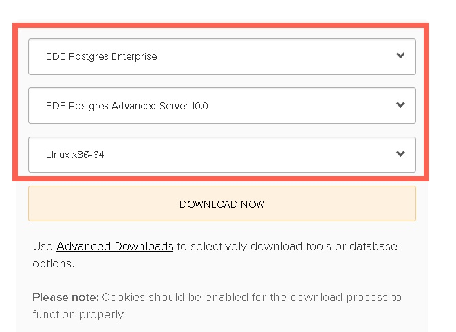
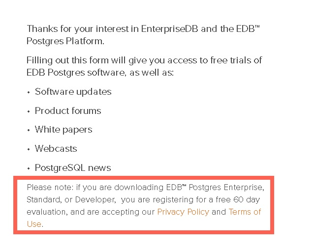
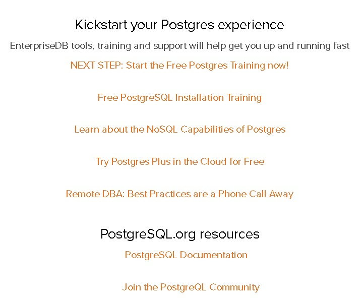
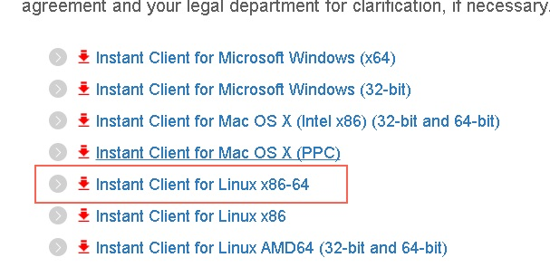
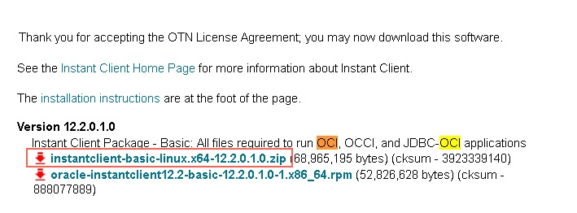

## PostgreSQL 商用版本EPAS(阿里云ppas) - 用户端测试环境部署(EPAS 安装、配置、管理)   
                           
### 作者                           
digoal                           
                           
### 日期                           
2018-01-19                          
                           
### 标签                           
PostgreSQL , Enterprisedb , EPAS , ppas , 测试    
                           
----                           
                           
## 背景     
PostgreSQL 商用版本EPAS( [阿里云ppas](https://www.aliyun.com/product/rds/ppas) )，如何自己部署一套PPAS数据库在客户端进行测试？    
   
## 部署PPAS数据库   
### 配置操作系统   
（为了更好的性能、稳定性）：   
   
可以参考以下文章中的OS配置部分(主要包括sysctl.conf, limit等配置)：     
   
[《PostgreSQL 10 on ECS 实施 流复制备库镜像+自动快照备份+自动备份验证+自动清理备份与归档》](../201711/20171129_02.md)     
   
[《PostgreSQL 10 + PostGIS + Sharding(pg_pathman) + MySQL(fdw外部表) on ECS 部署指南(适合新用户)》](../201710/20171018_01.md)     
   
[《PostgreSQL on ECS多云盘的部署、快照备份和恢复》](../201708/20170812_01.md)     
   
[《PostgreSQL on Linux 最佳部署手册》](../201611/20161121_01.md)     
   
   
### 下载PPAS安装包   
如果你需要自己挑选工具或组件进行下载，请打开以下链接进行选择。   
   
https://www.enterprisedb.com/advanced-downloads   
   
   
本文选择，傻瓜式打包下载，请打开以下链接，选择对应的产品下载：   
   
https://www.enterprisedb.com/software-downloads-postgres   
   
选择版本：   
   
   
   
点击下载，会给你一个提示，仅用于60天的试用：   
   
   
   
然后你需要输入一个EDB注册的账号（[免费注册链接](https://www.enterprisedb.com/user-login-registration)，比如:   digoal@126.com , 123456 ）：       
   
   
   
开始下载，下载页面会附上EDB的文档等链接，需要的话你可以点进去看一下。   
   
   
   
下载完成后，将安装包拷贝到服务器（建议CentOS 7.4 x64）。   
   
### 安装PPAS软件和初始化数据库   
   
1、解压安装包   
   
```   
[root@digoal ~]# mkdir edb   
[root@digoal ~]# mv edb-as10-server-10.1.5-1-linux-x64.tar.gz  edb/   
[root@digoal ~]# cd edb   
[root@digoal edb]# ll   
total 126224   
-rw-r--r-- 1 root root 129249660 Jan 19 10:17 edb-as10-server-10.1.5-1-linux-x64.tar.gz   
[root@digoal edb]# tar -zxvf edb-as10-server-10.1.5-1-linux-x64.tar.gz    
edb-as10-server-10.1.5-1-linux-x64/   
edb-as10-server-10.1.5-1-linux-x64/README_FIRST_Linux64.txt   
edb-as10-server-10.1.5-1-linux-x64/edb-as10-server-10.1.5-1-linux-x64.run   
[root@digoal edb]# ll   
total 126228   
drwxrwxr-x 2  501  501      4096 Nov  8 12:05 edb-as10-server-10.1.5-1-linux-x64   
-rw-r--r-- 1 root root 129249660 Jan 19 10:17 edb-as10-server-10.1.5-1-linux-x64.tar.gz   
[root@digoal edb]# cd edb-as10-server-10.1.5-1-linux-x64   
[root@digoal edb-as10-server-10.1.5-1-linux-x64]# ll   
total 127604   
-rwxr-xr-x 1 501 501 130656365 Nov  8 12:05 edb-as10-server-10.1.5-1-linux-x64.run   
-rw-rw-r-- 1 501 501      5569 Nov  8 12:05 README_FIRST_Linux64.txt   
```   
   
2、执行安装程序   
   
```   
[root@digoal edb-as10-server-10.1.5-1-linux-x64]# ./edb-as10-server-10.1.5-1-linux-x64.run    
   
```   
   
3、安装过程，会遇到一些需要输入的地方，根据实际情况输入   
   
```   
----------------------------------------------------------------------------   
Welcome to the EDB Postgres Advanced Server Setup Wizard.   
   
----------------------------------------------------------------------------   
Please read the following License Agreement. You must accept the terms of this    
agreement before continuing with the installation.   
```   
   
回车，看完它的license   
   
```   
Press [Enter] to continue:   
```   
   
选择y，同意它的license   
   
```   
Do you accept this license? [y/n]: y   
```   
   
然后又会提示你输入EDB的账号密码   
   
   
```   
User Authentication   
   
This installation requires a registration with EnterpriseDB.com. Please enter    
your credentials below. If you do not have an account, Please create one now on    
https://www.enterprisedb.com/user-login-registration   
   
   
   
Email []: digoal@126.com   
   
Password : 123456   
```   
   
输入安装路径，不输入的话，会使用这里的默认路径   
   
```   
----------------------------------------------------------------------------   
Please specify the directory where EDB Postgres Advanced Server will be    
installed.   
   
Installation Directory [/opt/edb/as10]:    
```   
   
选择安装组件，并确认   
   
```   
----------------------------------------------------------------------------   
Select the components you want to install; clear the components you do not want    
to install. Click Next when you are ready to continue.   
   
EDB Postgres Advanced Server [Y/n] :Y   
   
pgAdmin 4 [Y/n] :n   
   
StackBuilder Plus [Y/n] :n   
   
Command Line Tools [Y/n] :Y   
   
Is the selection above correct? [Y/n]: Y   
```   
   
输入你的数据目录，REDO(wal)目录。建议两者使用不同的块设备分区，并确保使用足够大的空间。wal的目录建议IOPS极好。   
   
```   
----------------------------------------------------------------------------   
Additional Directories   
   
Please select a directory under which to store your data.   
   
Data Directory [/opt/edb/as10/data]: /data01/edb/as10/data      # 不建议使用默认配置   
   
Please select a directory under which to store your Write-Ahead Logs.   
   
Write-Ahead Log (WAL) Directory [/opt/edb/as10/data/pg_wal]: /data02/edb/as10/pg_wal      # 不建议使用默认配置     
   
----------------------------------------------------------------------------   
```   
   
选择你需要兼容Oracle还是PostgreSQL，选择Oracle的话，会安装Oracle的一些兼容类型、包、视图、函数等，同时数据类型的显示会兼容Oracle的风格。   
   
如果不需要Oracle的兼容性，建议选择兼容PostgreSQL。更方便的逃离Oracle。   
   
```   
----------------------------------------------------------------------------   
Advanced Server Dialect   
   
EDB Postgres Advanced Server can be configured in one of two "Dialects" - 1) Compatible with Oracle or 2) Compatible with Postgres.   
   
If you select Compatible with Oracle, Advanced Server will be configured with appropriate data type conversions, time and date formats, Oracle-styled operators,    
dictionary views and more. This makes it easier to migrate or write new applications that are more compatible with the Oracle database.   
   
If you select Compatible with Postgres, Advanced Server will be configured with standard PostgeSQL data types, time/date formats and operators.   
   
Advanced Server Dialect   
   
[1] Compatible with Oracle   
[2] Compatible with Postgres   
Please choose an option [1] :      # 根据实际需要选择   
```   
   
输入数据库初始超级用户enterprisedb的密码，   
   
```   
----------------------------------------------------------------------------   
Please provide a password for the database superuser (enterprisedb). A locked    
Unix user account (enterprisedb) will be created if not present.   
   
Password : IlovePG   
Retype Password : IlovePG   
```   
   
输入数据库的监听端口号：   
   
```   
Please select the port number the server should listen on.   
   
Port [5444]: 1921   
```   
   
输入数据库字符集：   
   
```   
...   
[764] zh_CN.utf8   
...   
   
Please choose an option [1] : 764   
```   
   
是否安装示范表和存储过程，不需要。   
   
   
```   
Install sample tables and procedures. [y/N]: N   
```   
   
EDB具备动态优化的功能，这里会询问你的服务器是不是数据库独占的   
   
```   
----------------------------------------------------------------------------   
Dynatune Dynamic Tuning:   
Server Utilization   
   
Please select the type of server to determine the amount of system resources    
that may be utilized:   
   
   
   
[1] Development (e.g. a developer's laptop)   
[2] General Purpose (e.g. a web or application server)   
[3] Dedicated (a server running only Advanced Server)   
Please choose an option [2] : 2   
```   
   
这里会询问你的数据库用于什么业务场景，oltp, htap, olap 三个选项。   
   
```   
----------------------------------------------------------------------------   
Dynatune Dynamic Tuning:   
Workload Profile   
   
Please select the type of workload this server will be used for:   
   
   
   
[1] Transaction Processing (OLTP systems)   
[2] General Purpose (OLTP and reporting workloads)   
[3] Reporting (Complex queries or OLAP workloads)   
Please choose an option [1] :    
```   
   
准备安装，再次确认你的配置是否正确：   
   
```   
----------------------------------------------------------------------------   
Pre Installation Summary   
   
The following settings will be used for the installation::   
   
Installation Directory: /opt/edb/as10   
Server Installation Directory: /opt/edb/as10   
Data Directory: /data01/edb/as10/data   
WAL Directory: /data02/edb/as10/pg_wal   
Database Port: 1921   
Database Superuser: enterprisedb   
Operating System Account: enterprisedb   
Database Service: edb-as-10   
Command Line Tools Installation Directory: /opt/edb/as10   
```   
   
回车继续   
   
```   
Press [Enter] to continue:   
   
----------------------------------------------------------------------------   
Setup is now ready to begin installing EDB Postgres Advanced Server on your    
computer.   
```   
   
确认开始安装   
   
```   
Do you want to continue? [Y/n]: Y   
   
----------------------------------------------------------------------------   
Please wait while Setup installs EDB Postgres Advanced Server on your computer.   
   
 Installing EDB Postgres Advanced Server    
 0% ______________ 50% ______________ 100%   
 #########################################   
   
----------------------------------------------------------------------------   
Setup has finished installing EDB Postgres Advanced Server on your computer.   
```   
   
4、安装结束后，会新建一个操作系统用户enterprisedb，同时新增一个随操作系统自动启动数据库的服务。   
   
## 安装Oracle OCI   
   
1、安装Oracle OCI。这样才可以在EDB数据库中建立ORACLE的DBLINK。   
   
http://www.oracle.com/technetwork/database/features/instant-client/index-097480.html   
   
选择下载包含OCI的包（ 需要输入Oracle的账号密码。 可以免费注册。  zzz@qware.com , 111111 ）   
   
   
   
   
   
将安装包上传到服务器，解压，放到EDB的PGHOME目录，并建立软链。详情参考   
   
https://www.enterprisedb.com/docs/en/10.0/Ora_Compat_Dev_Guide/Database_Compatibility_for_Oracle_Developers_Guide.1.124.html#   
   
操作如下   
   
```   
[root@digoal ~]# mkdir oci   
[root@digoal ~]# mv instantclient-basic-linux.x64-12.2.0.1.0.zip oci/   
[root@digoal ~]# cd oci   
[root@digoal oci]# ll   
total 67356   
-rw-r--r-- 1 root root 68965195 Jan 19 11:00 instantclient-basic-linux.x64-12.2.0.1.0.zip   
[root@digoal oci]# unzip instantclient-basic-linux.x64-12.2.0.1.0.zip    
Archive:  instantclient-basic-linux.x64-12.2.0.1.0.zip   
  inflating: instantclient_12_2/adrci     
  inflating: instantclient_12_2/BASIC_README     
  inflating: instantclient_12_2/genezi     
  inflating: instantclient_12_2/libclntshcore.so.12.1     
  inflating: instantclient_12_2/libclntsh.so.12.1     
  inflating: instantclient_12_2/libipc1.so     
  inflating: instantclient_12_2/libmql1.so     
  inflating: instantclient_12_2/libnnz12.so     
  inflating: instantclient_12_2/libocci.so.12.1     
  inflating: instantclient_12_2/libociei.so     
  inflating: instantclient_12_2/libocijdbc12.so     
  inflating: instantclient_12_2/libons.so     
  inflating: instantclient_12_2/liboramysql12.so     
  inflating: instantclient_12_2/ojdbc8.jar     
  inflating: instantclient_12_2/uidrvci     
  inflating: instantclient_12_2/xstreams.jar     
[root@digoal oci]# ll   
total 67360   
drwxr-xr-x 2 root root     4096 Jan 19 11:02 instantclient_12_2   
-rw-r--r-- 1 root root 68965195 Jan 19 11:00 instantclient-basic-linux.x64-12.2.0.1.0.zip   
[root@digoal oci]# cd instantclient   
-bash: cd: instantclient: No such file or directory   
[root@digoal oci]# cd instantclient_12_2/   
[root@digoal instantclient_12_2]# ll   
total 216696   
-rwxrwxr-x 1 root root     44220 Jan 26  2017 adrci   
-rw-rw-r-- 1 root root       363 Jan 26  2017 BASIC_README   
-rwxrwxr-x 1 root root     57272 Jan 26  2017 genezi   
-rwxrwxr-x 1 root root   8033199 Jan 26  2017 libclntshcore.so.12.1   
-rwxrwxr-x 1 root root  71638263 Jan 26  2017 libclntsh.so.12.1   
-r-xr-xr-x 1 root root   2981501 Jan 26  2017 libipc1.so   
-r-xr-xr-x 1 root root    539065 Jan 26  2017 libmql1.so   
-r-xr-xr-x 1 root root   6568149 Jan 26  2017 libnnz12.so   
-rwxrwxr-x 1 root root   2218687 Jan 26  2017 libocci.so.12.1   
-rwxrwxr-x 1 root root 124771800 Jan 26  2017 libociei.so   
-r-xr-xr-x 1 root root    158543 Jan 26  2017 libocijdbc12.so   
-r-xr-xr-x 1 root root    380996 Jan 26  2017 libons.so   
-rwxrwxr-x 1 root root    116563 Jan 26  2017 liboramysql12.so   
-r--r--r-- 1 root root   4036257 Jan 26  2017 ojdbc8.jar   
-rwxrwxr-x 1 root root    240476 Jan 26  2017 uidrvci   
-rw-rw-r-- 1 root root     74230 Jan 26  2017 xstreams.jar   
   
[root@digoal instantclient_12_2]# cp libclntsh.so.12.1 /opt/edb/as10/lib/   
[root@digoal instantclient_12_2]# cd /opt/edb/as10/lib   
[root@digoal lib]# ln -s libclntsh.so.12.1 libclntsh.so   
```   
   
## 配置enterprisedb用户环境变量   
   
```   
[root@digoal edb-as10-server-10.1.5-1-linux-x64]# vi /opt/edb/as10/.bash_profile   
   
export PS1="$USER@`/bin/hostname -s`-> "   
export PGPORT=1921   
export PGDATA=/data01/edb/as10/data   
export LANG=en_US.utf8   
export PGHOME=/opt/edb/as10   
export LD_LIBRARY_PATH=$PGHOME/lib:/lib64:/usr/lib64:/usr/local/lib64:/lib:/usr/lib:/usr/local/lib:$LD_LIBRARY_PATH   
export DATE=`date +"%Y%m%d%H%M"`   
export PATH=$PGHOME/bin:$PATH:.   
export MANPATH=$PGHOME/share/man:$MANPATH   
export PGHOST=$PGDATA   
export PGUSER=enterprisedb   
export PGDATABASE=postgres   
alias rm='rm -i'   
alias ll='ls -lh'   
unalias vi   
```   
   
   
   
## 修改数据库参数配置，让数据库运行更爽一点   
连接到enterprisedb用户   
   
```   
[root@digoal edb-as10-server-10.1.5-1-linux-x64]# su - enterprisedb   
```   
   
```   
cd $PGDATA   
   
vi postgresql.conf   
   
   
listen_addresses = '0.0.0.0'   
port = 1921   
max_connections = 2000   
unix_socket_directories = '.'   
tcp_keepalives_idle = 60   
tcp_keepalives_interval = 10   
tcp_keepalives_count = 10   
shared_buffers = 128MB   
work_mem = 4MB   
maintenance_work_mem = 64MB   
dynamic_shared_memory_type = posix   
shared_preload_libraries = 'pg_stat_statements,auto_explain,$libdir/dbms_pipe,$libdir/edb_gen,$libdir/dbms_aq'   
vacuum_cost_delay = 0   
bgwriter_delay = 10ms   
bgwriter_lru_maxpages = 500   
effective_io_concurrency = 0   
max_worker_processes = 128   
max_parallel_workers_per_gather = 8   
max_parallel_workers = 32   
wal_level = replica   
synchronous_commit = off   
wal_buffers = 64MB   
wal_writer_delay = 10ms   
checkpoint_timeout = 30min   
max_wal_size = 16GB   
min_wal_size = 8GB   
checkpoint_completion_target = 0.1   
archive_mode = on   
archive_command = '/bin/date'   
random_page_cost = 1.1   
log_destination = 'csvlog'   
logging_collector = on   
log_truncate_on_rotation = on   
log_checkpoints = on   
log_connections = on   
log_disconnections = on   
log_error_verbosity = verbose      
log_line_prefix = '%t '   
log_lock_waits = on   
log_statement = 'ddl'   
log_timezone = 'PRC'   
autovacuum = on   
log_autovacuum_min_duration = 0   
autovacuum_max_workers = 5   
autovacuum_freeze_max_age = 800000000   
autovacuum_multixact_freeze_max_age = 900000000   
autovacuum_vacuum_cost_delay = 0   
vacuum_freeze_min_age = 50000000   
vacuum_freeze_table_age = 750000000   
vacuum_multixact_freeze_min_age = 5000000   
vacuum_multixact_freeze_table_age = 750000000   
datestyle = 'redwood,show_time'   
timezone = 'PRC'   
lc_messages = 'en_US.utf8'   
lc_monetary = 'en_US.utf8'   
lc_numeric = 'en_US.utf8'   
lc_time = 'en_US.utf8'   
default_text_search_config = 'pg_catalog.simple'   
edb_redwood_date = on   
edb_redwood_greatest_least = on   
edb_redwood_strings = on   
db_dialect = 'redwood'                 
edb_dynatune = 66   
edb_dynatune_profile = oltp   
timed_statistics = off   
```   
   
修改数据库防火墙，允许外部连接：ACL   
   
```   
vi pg_hba.conf   
   
# TYPE  DATABASE        USER            ADDRESS                 METHOD   
   
# "local" is for Unix domain socket connections only   
local   all             all                                     trust   
# IPv4 local connections:   
host    all             all             127.0.0.1/32            md5   
# IPv6 local connections:   
host    all             all             ::1/128                 md5   
# Allow replication connections from localhost, by a user with the   
# replication privilege.   
local   replication     all                                     md5   
host    replication     all             127.0.0.1/32            md5   
host    replication     all             ::1/128                 md5   
host all all 0.0.0.0/0 md5   
```   
   
重启数据库，   
   
```   
pg_ctl restart -m fast   
```   
   
## 简单使用举例   
1、创建用户，   
   
create role digoal login encrypted password 'pwd';   
   
2、创建数据库，   
   
create database db1 with template template1;   
   
grant all on database db1 to digoal;   
   
3、连接数据库，   
   
```   
psql -h xxx.xxx.xxx.xxx -p 1921 -U digoal db1   
```   
   
4、图形化客户端，pgadmin是一个非常好用的PG图形化管理工具   
   
https://www.pgadmin.org/download/   
   
   
5、创建oracle DBLINK   
   
使用SQL创建   
   
```   
Command:     CREATE DATABASE LINK   
Description: create a new database link   
Syntax:   
CREATE [PUBLIC] DATABASE LINK name   
    CONNECT TO username   
    IDENTIFIED BY password   
    USING [ "oci" | "libpq" ] 'connection_string'   
```   
   
或者可以使用UDF接口创建   
   
   
https://www.enterprisedb.com/docs/en/10.0/Ora_Compat_Dev_Guide/Database_Compatibility_for_Oracle_Developers_Guide.1.124.html#   
   
```   
                                                       List of functions   
   Schema   |                Name                | Result data type  |              Argument data types               |  Type     
------------+------------------------------------+-------------------+------------------------------------------------+--------   
 pg_catalog | dblink_ora_call                    | SETOF record      | text, text, numeric                            | normal   
 pg_catalog | dblink_ora_connect                 | text              | text                                           | normal   
 pg_catalog | dblink_ora_connect                 | text              | text, boolean                                  | normal   
 pg_catalog | dblink_ora_connect                 | text              | text, text, text, text, text, integer          | normal   
 pg_catalog | dblink_ora_connect                 | text              | text, text, text, text, text, integer, boolean | normal   
 pg_catalog | dblink_ora_copy                    | bigint            | text, text, text, text                         | normal   
 pg_catalog | dblink_ora_copy                    | bigint            | text, text, text, text, boolean                | normal   
 pg_catalog | dblink_ora_copy                    | bigint            | text, text, text, text, boolean, integer       | normal   
 pg_catalog | dblink_ora_disconnect              | text              | text                                           | normal   
 pg_catalog | dblink_ora_exec                    | void              | text, text                                     | normal   
 pg_catalog | dblink_ora_record                  | SETOF record      | text, text                                     | normal   
 pg_catalog | dblink_ora_status                  | text              | text                                           | normal   
```   
   
## 其他资料   
   
[《PostgreSQL 商用版本EPAS(阿里云ppas) 自定义custom plan次数》](../201801/20180118_04.md)     
   
[《PostgreSQL 模糊查询 与 正则匹配 性能差异与SQL优化建议》](../201801/20180118_03.md)     
   
[《PostgreSQL 商用版本EPAS(阿里云ppas) SQL防火墙使用（白名单管理、防SQL注入、防DDL等）》](../201801/20180116_02.md)     
   
[《PostgreSQL 商用版本EPAS(阿里云ppas) NUMA 架构spin锁等待优化》](../201801/20180113_04.md)     
   
[《PostgreSQL 商用版本EPAS(阿里云ppas) 自动(postgresql.conf)参数计算与适配功能》](../201801/20180113_03.md)     
   
[《PostgreSQL 商用版本EPAS(阿里云ppas) 索引推荐功能使用》](../201801/20180113_02.md)     
   
[《PostgreSQL 商用版本EPAS(阿里云ppas) HTAP功能之资源隔离管理 - CPU与刷脏资源组管理》](../201801/20180113_01.md)     
   
   
   
## 参考   
   
[《PostgreSQL 10 on ECS 实施 流复制备库镜像+自动快照备份+自动备份验证+自动清理备份与归档》](../201711/20171129_02.md)     
   
[《PostgreSQL 10 + PostGIS + Sharding(pg_pathman) + MySQL(fdw外部表) on ECS 部署指南(适合新用户)》](../201710/20171018_01.md)     
   
[《PostgreSQL on ECS多云盘的部署、快照备份和恢复》](../201708/20170812_01.md)     
   
[《PostgreSQL on Linux 最佳部署手册》](../201611/20161121_01.md)     
  
