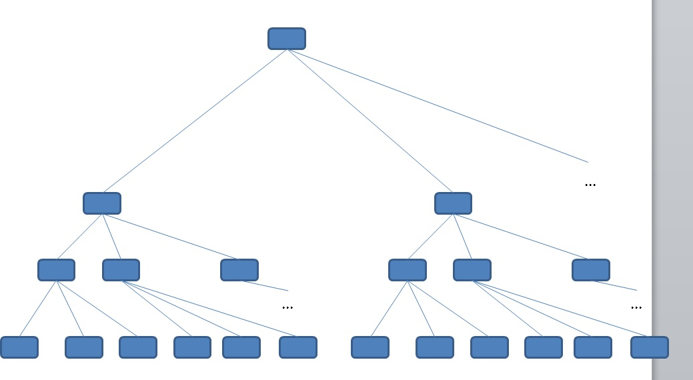
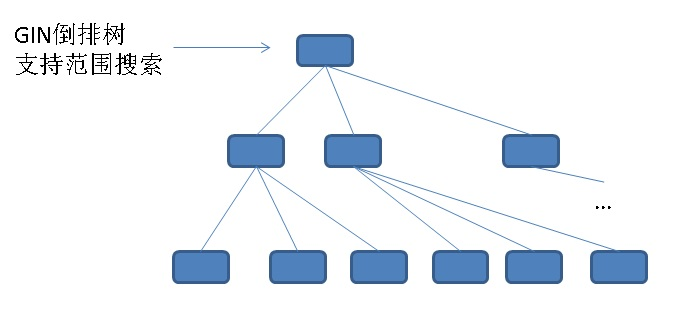

## PostgreSQL 店铺运营实践 - JSON[]数组 内部标签数据等值、范围检索100倍+加速示例 (含，单值+多值列合成) 
                     
### 作者                      
digoal     
       
### 日期     
2018-02-08    
                     
### 标签                      
PostgreSQL , json , 数组 , 多值 , 等值 , 多值 , 一棵树 , 多颗树 , gin , btree , gist    
                         
----                        
                        
## 背景        
PostgreSQL的数组、JSON等数据类型，给业务方带来了很多便利。但与此同时，优化也会变得更加的烧脑。  
  
比如我们的业务方可能在数据库中存储了一些商品的信息，同时每个商品上会有若干的标签，每个标签使用一个JSON来表示。  
  
数据结构就会变这样：  
  
```  
create table js(  
  gid int,      -- 店铺ID  
  item int,     -- 商品ID  
  prop jsonb[]  -- 商品标签, json数组  
);  
```  
  
示例数据  
  
```  
1, 1, ['{"id":10, "score":80}', '{"id":11, "score":70}', '{"id":21, "score":60}', .....]   
1, 2, ['{"id":11, "score":50}', '{"id":13, "score":30}', '{"id":21, "score":80}', .....]   
.....  
```  
  
每个jsonb[]里面有若干个JSON。  
  
每个JSON里面有若干个ID。  
  
每个ID对应一个SCORE。  
  
业务方可能 要求查gid=? 并且包含某个ID，并且这个ID的SCORE在某个范围的数据。 以此找到某个店铺中满足某些标签条件的数据。  
  
```  
select * from js where gid=? and prop包含id=? 并且score between ? and ?的记录。  
```  
  
首先需要写一个UDF，来实现这类的查询。  
  
```  
create or replace function get_res(  
  jsonb[],   -- 输入的JSONB数组  
  int,       -- id  
  int,       -- score最小值  
  int        -- score最大值  
) returns boolean as $$  
declare  
  v_id int;  
  v_score int;  
  v_js jsonb;  
begin  
  foreach v_js in array $1 loop  
    if (v_js->>'id')::int = $2 and (v_js->>'score')::float4 between $3 and $4 then  
      return true;  
    end if;  
  end loop;  
  return false;  
end;  
$$ language plpgsql strict;  
```  
  
最终SQL变成这样  
  
```  
select * from js where gid=? and get_res(prop, ?, ?, ?);  
```  
  
以上方法只能用到GID的索引，其他索引用不到。所以存在大量的CPU计算。高并发下必将成为瓶颈。  
  
## 性能优化思路  
假设已知prop里面最多有N个json元素，如何让数据可以精确的被索引检索，提高性能？  
  
实际上，SQL可以改成这样：  
  
```  
select * from js where   
  (gid=? and prop[1]->>'id'=? and prop[1]->>'score' between x and x) or -- 每个JSON元素对应一颗树  
  (gid=? and prop[2]->>'id'=? and prop[2]->>'score' between x and x) or -- 每个JSON元素对应一颗树  
  ...  
```  
  
或  
  
```  
select * from js where   
  (gid=? and prop[1]->>'id'=? and prop[1]->>'score' between x and x)  
union all  
select * from js where   
  (gid=? and prop[2]->>'id'=? and prop[2]->>'score' between x and x)  
union all   
...  
;  
```  
  
虽然写了这么多OR的条件，实际上并不需要担心性能问题，因为用户提供的gid, id, score都是固定值，并且在同一条记录中id是唯一的，所以虽然扫描了多颗树，实际上最终检索时并没有产生IO或CPU放大(因为同一条记录一定只会在一颗树中被检索到)。  
  
### 优化方法：  
  
1、固定prop的json元素个数  
  
2、针对每一个json元素，构建复合表达式索引  
  
```  
create index idx_js_1 on js (gid, ((prop[1]->>'id')::int), ((prop[1]->>'score')::float4));  
create index idx_js_2 on js (gid, ((prop[2]->>'id')::int), ((prop[2]->>'score')::float4));  
create index idx_js_3 on js (gid, ((prop[3]->>'id')::int), ((prop[3]->>'score')::float4));  
create index idx_js_4 on js (gid, ((prop[4]->>'id')::int), ((prop[4]->>'score')::float4));  
create index idx_js_5 on js (gid, ((prop[5]->>'id')::int), ((prop[5]->>'score')::float4));  
create index idx_js_6 on js (gid, ((prop[6]->>'id')::int), ((prop[6]->>'score')::float4));  
create index idx_js_7 on js (gid, ((prop[7]->>'id')::int), ((prop[7]->>'score')::float4));  
create index idx_js_8 on js (gid, ((prop[8]->>'id')::int), ((prop[8]->>'score')::float4));  
create index idx_js_9 on js (gid, ((prop[9]->>'id')::int), ((prop[9]->>'score')::float4));  
create index idx_js_10 on js (gid, ((prop[10]->>'id')::int), ((prop[10]->>'score')::float4));  
```  
  
3、改写SQL  
  
4、使用UDF，拼接动态SQL。或者程序端拼接动态SQL。  
  
```  
create or replace function get_js(  
  int,       -- loops, 一个prop里多少个json元素  
  int,       -- gid  
  int,       -- json id  
  int,       -- json score 最小值  
  int        -- json score 最大值  
) returns setof js as $$  
declare  
  sql text := 'select * from js where ';  
begin  
  for i in 1..$1 loop  
    sql := format($_$ %s (gid=%s and (prop[%s]->>'id')::int=%s and (prop[%s]->>'score')::float4 between %s and %s) union all select * from js where $_$, sql, $2, i, $3, i, $4, $5);  
  end loop;  
  sql := rtrim(sql, 'union all select * from js where ');  
  -- raise notice '%', sql;  
  return query execute sql;  
end;  
$$ language plpgsql strict;  
```  
  
查询动态拼接：  
  
```  
postgres=# select * from get_js(10,1,1,10,20);  
 gid | item | prop   
-----+------+------  
(0 rows)  
```  
  
索引被正确使用  
  
```  
postgres=# explain select * from js where  (gid=1 and (prop[1]->>'id')::int=1 and (prop[1]->>'score')::float4 between 10 and 20) union all select * from js where  (gid=1 and (prop[2]->>'id')::int=1 and (prop[2]->>'score')::float4 between 10 and 20) union all select * from js where  (gid=1 and (prop[3]->>'id')::int=1 and (prop[3]->>'score')::float4 between 10 and 20) union all select * from js where  (gid=1 and (prop[4]->>'id')::int=1 and (prop[4]->>'score')::float4 between 10 and 20) union all select * from js where  (gid=1 and (prop[5]->>'id')::int=1 and (prop[5]->>'score')::float4 between 10 and 20) union all select * from js where  (gid=1 and (prop[6]->>'id')::int=1 and (prop[6]->>'score')::float4 between 10 and 20) union all select * from js where  (gid=1 and (prop[7]->>'id')::int=1 and (prop[7]->>'score')::float4 between 10 and 20) union all select * from js where  (gid=1 and (prop[8]->>'id')::int=1 and (prop[8]->>'score')::float4 between 10 and 20) union all select * from js where  (gid=1 and (prop[9]->>'id')::int=1 and (prop[9]->>'score')::float4 between 10 and 20) union all select * from js where  (gid=1 and (prop[10]->>'id')::int=1 and (prop[10]->>'score')::float4 between 10 and 20);  
                                                                                                        QUERY PLAN                                                                                                          
----------------------------------------------------------------------------------------------------------------------------------------  
 Append  (cost=0.15..21.87 rows=10 width=40)  
   ->  Index Scan using idx_js_1 on js  (cost=0.15..2.18 rows=1 width=40)  
         Index Cond: ((gid = 1) AND (((prop[1] ->> 'id'::text))::integer = 1) AND (((prop[1] ->> 'score'::text))::real >= '10'::double precision) AND (((prop[1] ->> 'score'::text))::real <= '20'::doubleprecision))  
   ->  Index Scan using idx_js_2 on js js_1  (cost=0.15..2.18 rows=1 width=40)  
         Index Cond: ((gid = 1) AND (((prop[2] ->> 'id'::text))::integer = 1) AND (((prop[2] ->> 'score'::text))::real >= '10'::double precision) AND (((prop[2] ->> 'score'::text))::real <= '20'::doubleprecision))  
   ->  Index Scan using idx_js_3 on js js_2  (cost=0.15..2.18 rows=1 width=40)  
         Index Cond: ((gid = 1) AND (((prop[3] ->> 'id'::text))::integer = 1) AND (((prop[3] ->> 'score'::text))::real >= '10'::double precision) AND (((prop[3] ->> 'score'::text))::real <= '20'::doubleprecision))  
   ->  Index Scan using idx_js_4 on js js_3  (cost=0.15..2.18 rows=1 width=40)  
         Index Cond: ((gid = 1) AND (((prop[4] ->> 'id'::text))::integer = 1) AND (((prop[4] ->> 'score'::text))::real >= '10'::double precision) AND (((prop[4] ->> 'score'::text))::real <= '20'::doubleprecision))  
   ->  Index Scan using idx_js_5 on js js_4  (cost=0.15..2.18 rows=1 width=40)  
         Index Cond: ((gid = 1) AND (((prop[5] ->> 'id'::text))::integer = 1) AND (((prop[5] ->> 'score'::text))::real >= '10'::double precision) AND (((prop[5] ->> 'score'::text))::real <= '20'::doubleprecision))  
   ->  Index Scan using idx_js_6 on js js_5  (cost=0.15..2.18 rows=1 width=40)  
         Index Cond: ((gid = 1) AND (((prop[6] ->> 'id'::text))::integer = 1) AND (((prop[6] ->> 'score'::text))::real >= '10'::double precision) AND (((prop[6] ->> 'score'::text))::real <= '20'::doubleprecision))  
   ->  Index Scan using idx_js_7 on js js_6  (cost=0.15..2.18 rows=1 width=40)  
         Index Cond: ((gid = 1) AND (((prop[7] ->> 'id'::text))::integer = 1) AND (((prop[7] ->> 'score'::text))::real >= '10'::double precision) AND (((prop[7] ->> 'score'::text))::real <= '20'::doubleprecision))  
   ->  Index Scan using idx_js_8 on js js_7  (cost=0.15..2.18 rows=1 width=40)  
         Index Cond: ((gid = 1) AND (((prop[8] ->> 'id'::text))::integer = 1) AND (((prop[8] ->> 'score'::text))::real >= '10'::double precision) AND (((prop[8] ->> 'score'::text))::real <= '20'::doubleprecision))  
   ->  Index Scan using idx_js_9 on js js_8  (cost=0.15..2.18 rows=1 width=40)  
         Index Cond: ((gid = 1) AND (((prop[9] ->> 'id'::text))::integer = 1) AND (((prop[9] ->> 'score'::text))::real >= '10'::double precision) AND (((prop[9] ->> 'score'::text))::real <= '20'::doubleprecision))  
   ->  Index Scan using idx_js_10 on js js_9  (cost=0.15..2.18 rows=1 width=40)  
         Index Cond: ((gid = 1) AND (((prop[10] ->> 'id'::text))::integer = 1) AND (((prop[10] ->> 'score'::text))::real >= '10'::double precision) AND (((prop[10] ->> 'score'::text))::real <= '20'::doubleprecision))  
(21 rows)  
```  
  
5、如果元素个数增加，需要新增复合表达式索引  
  
注意这个方法提到的索引较多，所以DML性能会受到一定的影响，但是查询性能提升到了极致。  
  
### 其他知识点  
如果你不想用复合索引，可以改成单列表达式索引。  
  
思路与这篇类似：  
  
[《PostgreSQL UDF实现tsvector(全文检索), array(数组)多值字段与scalar(单值字段)类型的整合索引(类分区索引) - 单值与多值类型复合查询性能提速100倍+ 案例》](../201802/20180207_02.md)    
  
等值+范围搜索，都可以使用这种思路。  
  
例子  
  
```  
create index idx_js_1 on js ( (gid||'_'||prop[1]->>'id'||'_'||lpad(prop[1]->>'score',4,'0')) );  
.............  
```  
  
```  
select * from js where (gid||'_'||prop[1]->>'id'||'_'||lpad(prop[1]->>'score',4,'0')) between '1_1_0020' and '1_1_0100'  
union all  
select * from js where (gid||'_'||prop[2]->>'id'||'_'||lpad(prop[2]->>'score',4,'0')) between '1_1_0020' and '1_1_0100'  
union all  
....;  
```  
  
解释：  
  
把gid, prop->>id都合成到了索引里面  
  
最关键的还有一个lpad，因为分数可能位数不同，导致TEXT范围查询不符合预期，使用LPAD可以将这个位数填平，达到与数值一致的顺序效果。  
  
pad后效果如下:  
  
```  
postgres=# select '90' > '100';  
 ?column?   
----------  
 t  
(1 row)  
  
postgres=# select '090' > '100';  
 ?column?   
----------  
 f  
(1 row)  
```  
  
## 性能提升测试  
  
1、建表  
  
```  
create table js(  
  gid int,      -- 店铺ID  
  item int,     -- 商品ID  
  prop jsonb[],  -- 商品标签, json数组  
  primary key (gid,item)  
);  
```  
  
2、构造数据  
  
1万个GID，每个GID 10万个ITEM。  
  
每个PROP 10个JSONB，每个JSONB中ID取值范围0-1000，SCORE取值区间0-100  
  
```  
create or replace function ins(int, int) returns void as $$  
declare  
begin  
  insert into js values (  
    $1, $2,  
    array[  
      format('{"id":%s, "score":%s}', (random()*1000)::int, (random()*100)::int)::jsonb,  
      format('{"id":%s, "score":%s}', (random()*1000)::int, (random()*100)::int)::jsonb,  
      format('{"id":%s, "score":%s}', (random()*1000)::int, (random()*100)::int)::jsonb,  
      format('{"id":%s, "score":%s}', (random()*1000)::int, (random()*100)::int)::jsonb,  
      format('{"id":%s, "score":%s}', (random()*1000)::int, (random()*100)::int)::jsonb,  
      format('{"id":%s, "score":%s}', (random()*1000)::int, (random()*100)::int)::jsonb,  
      format('{"id":%s, "score":%s}', (random()*1000)::int, (random()*100)::int)::jsonb,  
      format('{"id":%s, "score":%s}', (random()*1000)::int, (random()*100)::int)::jsonb,  
      format('{"id":%s, "score":%s}', (random()*1000)::int, (random()*100)::int)::jsonb,  
      format('{"id":%s, "score":%s}', (random()*1000)::int, (random()*100)::int)::jsonb  
    ]  
  ) on conflict do nothing;  
end;  
$$ language plpgsql strict;  
```  
  
```  
vi test.sql  
\set gid random(1,10000)  
\set item random(1,100000)  
select ins(:gid, :item);  
```  
  
写入10亿记录  
  
```  
pgbench -M prepared -n -r -P 1 -f ./test.sql -c 50 -j 50 -t 20000000  
```  
  
3、索引  
  
```  
psql -c "create index idx_js_1 on js (gid, ((prop[1]->>'id')::int), ((prop[1]->>'score')::float4));" &  
psql -c "create index idx_js_2 on js (gid, ((prop[2]->>'id')::int), ((prop[2]->>'score')::float4));" &  
psql -c "create index idx_js_3 on js (gid, ((prop[3]->>'id')::int), ((prop[3]->>'score')::float4));" &  
psql -c "create index idx_js_4 on js (gid, ((prop[4]->>'id')::int), ((prop[4]->>'score')::float4));" &  
psql -c "create index idx_js_5 on js (gid, ((prop[5]->>'id')::int), ((prop[5]->>'score')::float4));" &  
psql -c "create index idx_js_6 on js (gid, ((prop[6]->>'id')::int), ((prop[6]->>'score')::float4));" &  
psql -c "create index idx_js_7 on js (gid, ((prop[7]->>'id')::int), ((prop[7]->>'score')::float4));" &  
psql -c "create index idx_js_8 on js (gid, ((prop[8]->>'id')::int), ((prop[8]->>'score')::float4));" &  
psql -c "create index idx_js_9 on js (gid, ((prop[9]->>'id')::int), ((prop[9]->>'score')::float4));" &  
psql -c "create index idx_js_10 on js (gid, ((prop[10]->>'id')::int), ((prop[10]->>'score')::float4));" &  
```  
  
4、原始方法压测  
  
```  
vi test1.sql  
  
\set gid random(1,10000)  
\set id random(0,1000)  
\set l random(0,50)  
\set u random(51,100)  
select * from js where gid=:gid and get_res(prop, :id, :l, :u);  
```  
  
```  
pgbench -M prepared -n -r -P 1 -f ./test1.sql -c 56 -j 56 -T 120  
```  
  
```  
transaction type: ./test1.sql  
scaling factor: 1  
query mode: prepared  
number of clients: 56  
number of threads: 56  
duration: 120 s  
number of transactions actually processed: 11517  
latency average = 582.923 ms  
latency stddev = 109.062 ms  
tps = 95.708298 (including connections establishing)  
tps = 95.927842 (excluding connections establishing)  
statement latencies in milliseconds:  
         0.004  \set gid random(1,10000)  
         0.001  \set id random(0,1000)  
         0.001  \set l random(0,50)  
         0.001  \set u random(51,100)  
       582.917  select * from js where gid=:gid and get_res(prop, :id, :l, :u);  
```  
  
```  
top - 12:37:42 up 28 days, 17:25,  3 users,  load average: 47.06, 19.61, 10.53  
Tasks: 542 total,  58 running, 484 sleeping,   0 stopped,   0 zombie  
%Cpu(s): 95.6 us,  4.3 sy,  0.0 ni,  0.0 id,  0.0 wa,  0.0 hi,  0.0 si,  0.0 st  
KiB Mem : 23094336+total, 85957776 free,  5347196 used, 13963840+buff/cache  
KiB Swap:        0 total,        0 free,        0 used. 17652979+avail Mem   
```  
  
5、优化方法压测  
  
```  
vi test2.sql  
  
\set gid random(1,10000)  
\set id random(0,1000)  
\set l random(0,50)  
\set u random(51,100)  
select * from get_js(10,:gid, :id, :l, :u);  
```  
  
```  
pgbench -M prepared -n -r -P 1 -f ./test2.sql -c 56 -j 56 -T 120  
```  
  
```  
transaction type: ./test2.sql  
scaling factor: 1  
query mode: prepared  
number of clients: 56  
number of threads: 56  
duration: 120 s  
number of transactions actually processed: 2042359  
latency average = 3.290 ms  
latency stddev = 0.300 ms  
tps = 16999.278637 (including connections establishing)  
tps = 17000.090714 (excluding connections establishing)  
statement latencies in milliseconds:  
         0.002  \set gid random(1,10000)  
         0.001  \set id random(0,1000)  
         0.000  \set l random(0,50)  
         0.001  \set u random(51,100)  
         3.288  select * from get_js(10,:gid, :id, :l, :u);  
```  
  
```  
top - 12:45:12 up 28 days, 17:32,  2 users,  load average: 22.72, 23.75, 17.37  
Tasks: 537 total,  58 running, 479 sleeping,   0 stopped,   0 zombie  
%Cpu(s): 93.8 us,  6.2 sy,  0.0 ni,  0.0 id,  0.0 wa,  0.0 hi,  0.0 si,  0.0 st  
KiB Mem : 23094336+total, 49231168 free,  8543336 used, 17316886+buff/cache  
KiB Swap:        0 total,        0 free,        0 used. 14191040+avail Mem   
```  
  
## 小结  
1、使用本文提到的多颗树APPEND的方法，没有浪费一丝丝CPU。性能提升N倍。  
  
数据量 | CASE | TPS | RT | CPU占比   
---|---|---|---|---  
10亿 | 原始方法 | 96 | 583 毫秒 | 100%  
10亿 | 优化方法 | 17000 | 3.3 毫秒 | 100%  
  
2、数据库内核层面优化建议，分区索引。内核层实现一个btree索引对应多棵树，解决数组内多值点查与区间查询的问题。  
  
  
  
3、目前PostgreSQL gin, gist索引对多值类型、数组、JSON的检索支持，只能支持到 包含、相交 层面，无法做到值的区间查找，如果有区间查找的需求，需要改进倒排树以及开发对应的OPS。  
  
  
  
https://www.postgresql.org/docs/10/static/datatype-json.html  
  
rum索引接口已经有一点点这个意思  
  
https://github.com/postgrespro/rum  
  
## 参考  
[《PostgreSQL UDF实现tsvector(全文检索), array(数组)多值字段与scalar(单值字段)类型的整合索引(类分区索引) - 单值与多值类型复合查询性能提速100倍+ 案例》](../201802/20180207_02.md)    
  
对于附加内容中提到的合并索引，假设score里面如果是浮点的话，需要重新设计一下索引的表达式，按整数的位数来进行PAD。     
     
